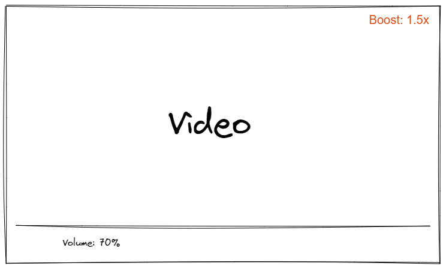

# Requirement

- User should be able to download and install in their browser: `either as an extension or bookmarklet`
- When playing a video`(youtube only for now)` this code should automatically find the right video element.
>- initialize itself to add audio gainNode to the video.✅
>- Boost value should be shown on the top right of the video element as shown in the image. -- boost value is shown for some time at the center of the screen.✅
>- When `+/-` keys are pressed boost value should increment and decrement by `0.1` ranging from `0` to `50`.✅
- Edit the boost value by clicking on it and entering the value.
- save boost value in local storage per video.
- load the boost value from local storage when the video is played again.